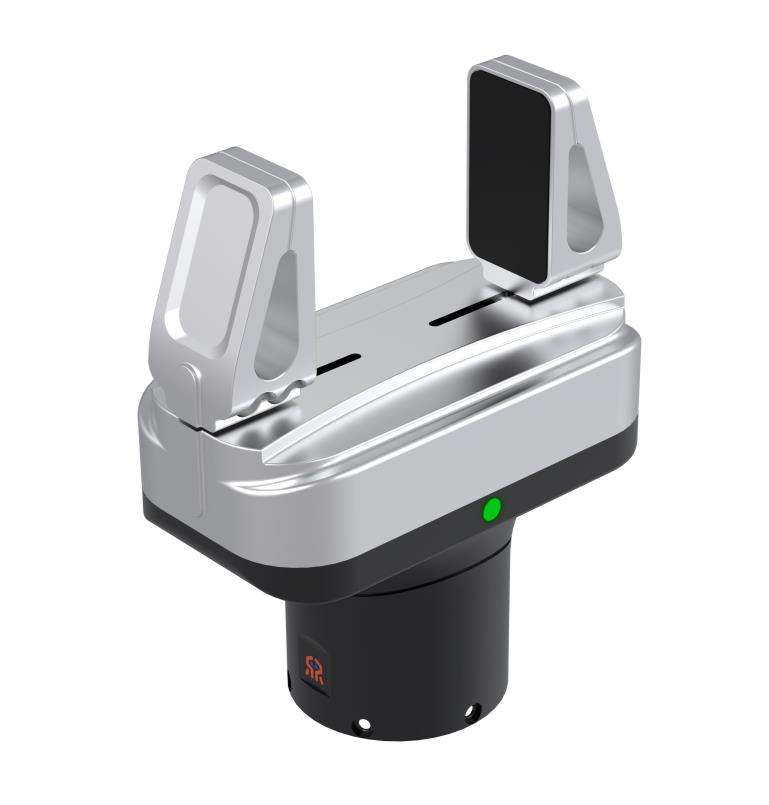
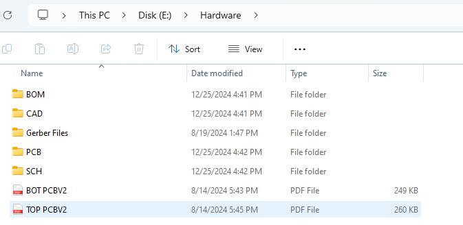
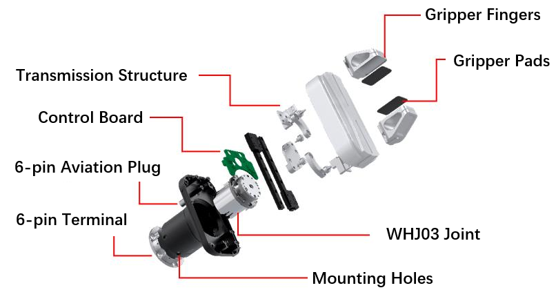
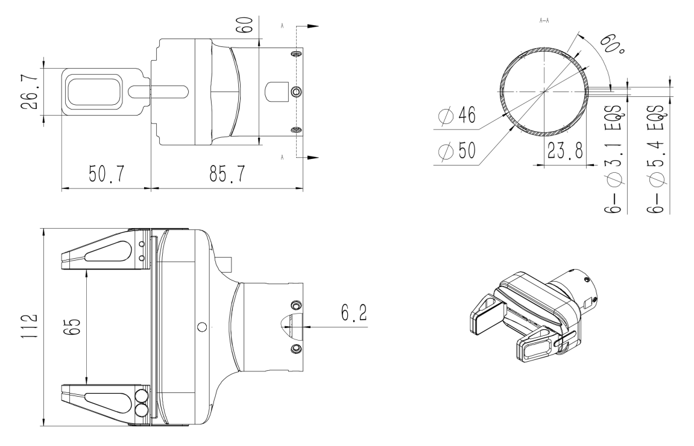
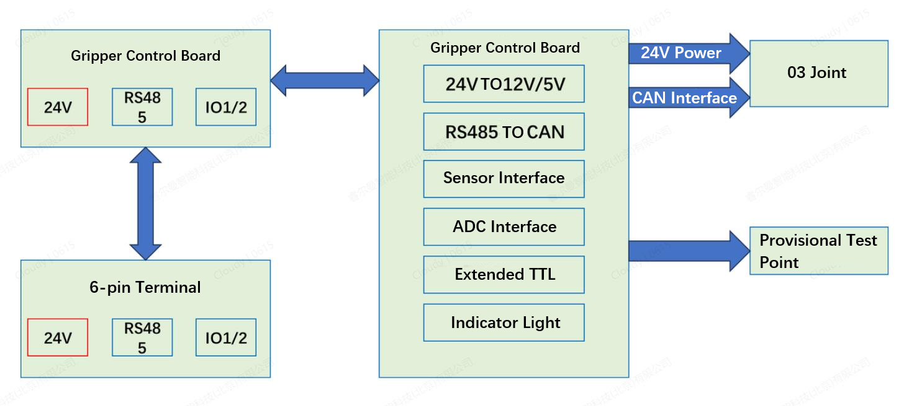
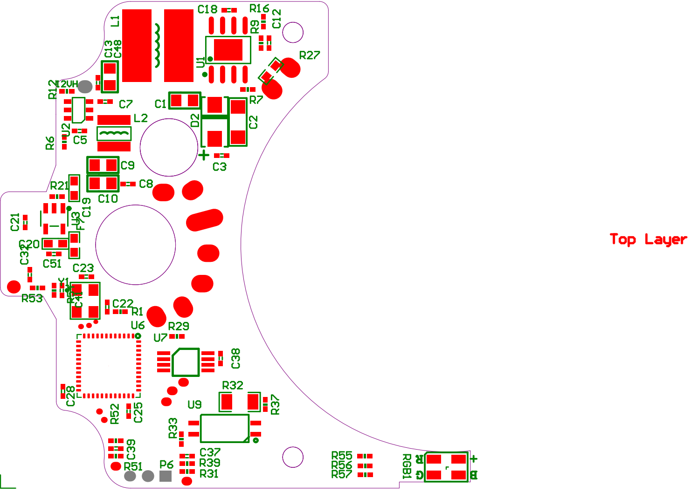
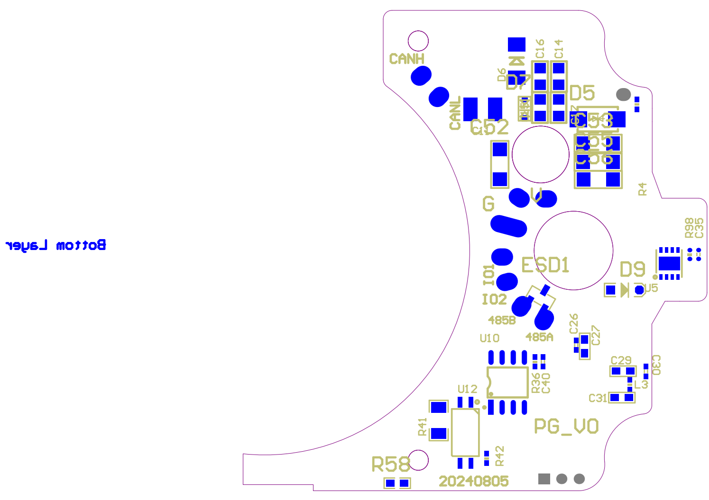
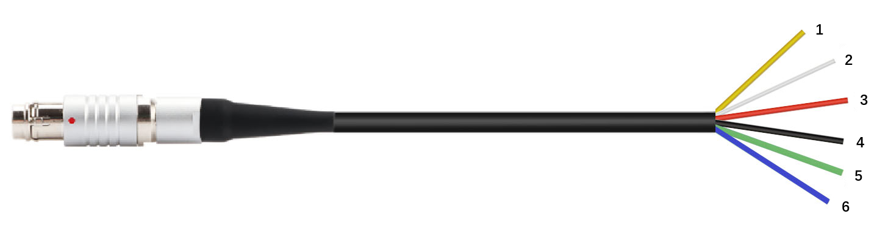
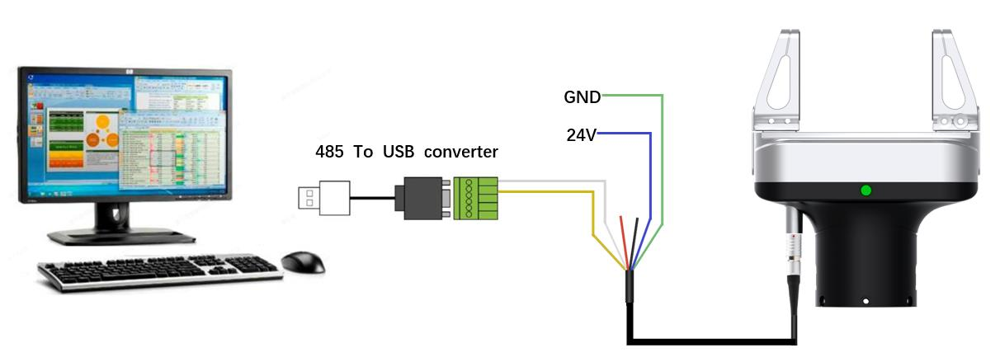
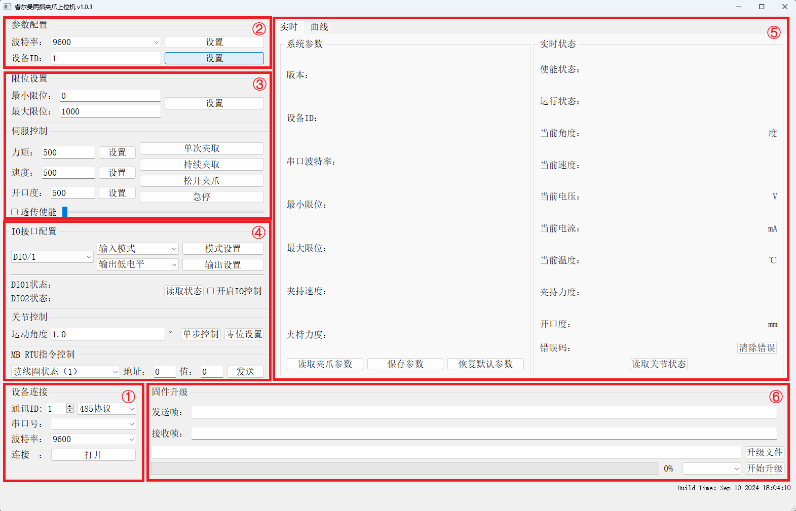

# 
 Open Source Project： 
 Two-Finger Parallel Gripper

## Copyright and License Agreement

This project is licensed under the MIT License. For details, please read the [Open Source Statement](License.md).

## Introduction

The Reilman Two-Finger Parallel Gripper is designed to provide users with easy-to-use and high-quality operational capabilities. The gripper is developed with the self-developed WHJ03 integrated joint as the core component, featuring high dynamic response, high load capacity, compact size, strong versatility, easy installation, and simple maintenance. According to task requirements, the gripper can be flexibly and conveniently deployed on complex robots, at the end of mechanical arms, or on PLC production lines, to address grasping, sorting, and handling needs in industrial, commercial, domestic, and educational scenarios. The robot uses a standard RS485 communication interface, supporting serial port protocol and Modbus RTU protocol. The simple and efficient interface and control commands allow users to quickly achieve control of the gripper.
 
Reilman also provides a host computer software for the gripper, which can meet the operational needs for targets of different textures and shapes by setting various parameters such as gripping force, speed, position, etc.
 

**Key Features**:

- **High Dynamic Response**: Opening size is 65mm, with a single-trip opening and closing time of 0.4s;
- **High Load Capacity**: Weighs only about 0.5kg, with a rated load of up to 4kg and a maximum load of 5kg;
- **Strong Versatility**: The gripper is equipped with two types of RS485 interfaces, a 6-pin aviation plug and a 6-pin PH2.0 terminal, supporting serial port protocol, Modbus RTU protocol, and I/O control;
- **User-Friendly**: Various control modes, easy to operate, suitable for a variety of scenarios;
- **Open Source Technical Solution**: The technical solution of the gripper is fully open source, promoting industry development.

## Hardware Design

The related hardware is open source. For downloads, please refer to [Related Downloads](#related-downloads). 

### Main Body Structure

The main body structure of the two-finger parallel gripper is as follows:

1. WHJ03 Joint: The WHJ03 joint, as the core power module of the two-finger parallel gripper, provides force and motion. For details, please refer to [WHJ03 Joint](https://develop.realman-robotics.com/joints/parameter/WHJ03/);
2. Transmission Mechanism: The transmission mechanism is the main component that converts the joint's rotational motion into linear motion;
3. Control Board: The control board provides joint control, RS485 communication, system power supply, and expansion interface functions;
4. Communication Interface: The communication interface is a six-pin aviation plug and a six-pin PH2.0 terminal, as shown in the figure;
5. Gripper Fingers: The gripper fingers are divided into standard gripper fingers and extended gripper fingers, which are the direct structural components for the gripper's operational functions.

### 3D Model

The 3D model diagram of the two-finger parallel gripper can be found in the file named **RMG24 Gripper 3D Model** under the `Hardware > CAD` directory of the obtained open-source files. The external dimensions of the two-finger parallel gripper are shown in the following figure.

### Control Board

#### Hardware System

The hardware system of the two-finger parallel gripper is shown in the following figure.

#### Single Board Production

For single board fabrication, you can refer to the files under the `Hardware > Gerber` Files path in the available open-source files, or generate the corresponding Gerber files for single board fabrication through the **TURN PCB.PcbDoc** file under the `Hardware > PCB` path.

::: warning Note
The **Gerber Files** are recommended to be opened with **Huaqiu DFM** software, and the **TURN PCB.PcbDoc** is a PCB format file, which is recommended to be opened with **Altium Designer** software.
:::

#### Component Soldering

Component soldering can refer to the **PG_V0.SchDoc** file under the `Hardware > SCH` PCB path in the obtained open-source files, or the **BOT PCBV2** and **TOP PCBV2** files under the `Hardware` path for soldering.

::: warning Note
The **PG_V0.SchDoc** is an SCH format file, which is recommended to be opened with **Altium Designer** software.
:::

#### BOM

For the BOM information of the control board, please refer to the **Claw Interface Board BOM** file under the `Hardware > BOM` path in the obtained open-source files.

### Communication Interface

The two-finger parallel gripper uses a 6-pin aviation plug and a 6-pin PH2.0 terminal for communication interfaces.

#### Wiring Definition

**6-pin Aviation Plug:**

- Custom aviation plug, compact size, can be directly connected to RM mechanical arms, easy to use;
- Since the core number and wire sequence of other mechanical arm manufacturers are different, it is necessary to rearrange according to the wire sequence function;
- Supports two IO interfaces, as the two-finger parallel gripper is mainly used for mechanical arms, only the RS485 and Modus-RTU interfaces need to be retained to meet the needs of most scenarios.

**6-pin PH2.0 Terminal:**

- Fixedly installed at the bottom of the gripper mounting seat with a female header.
- Connected to the 6-pin terminal male header output by the mechanical arm end cover to achieve internal wiring, avoiding interference caused by external wiring during the grasping process of the two-finger parallel gripper.

  

6-pin Aviation Plug

  

6-pin PH2.0 Terminal

#### Wire Sequence and Function

The wire sequence and functions of the 6-pin aviation plug and the 6-pin PH2.0 terminal are the same, as shown in the following table.

|Wire Number|Color|Note|Description|
|-|-|-|-|
|1|Yellow|RS485_A|RS485 communication A+|
|2|White|RS485_B|RS485 communication B-|
|3|Red|DI1/DO1|I/O multiplexed interface 1|
|4|Black|DI2/DO2|I/O multiplexed interface 2|
|5|Blue|Power GND|Power negative pole|
|6|Green|Power Input 24V|Power positive pole|

## Software Resources

The software code has been open sourced. Please visit [Related Downloads](#related-downloads) to download, with continuous upgrades and updates to come.

### Software Source Code

The following are the open-source application programs, boot programs, and master control source codes for the two-finger parallel claw. Please refer to the corresponding source code files in the `Software` path of the obtained open-source files.

|No.|Name|Description|
|-|-|-|
|1|gripper_app|The source code for the gripper control board application program|
|2|gripper_boot|The source code for the gripper control board boot program|
|3|gripper_tool|The host computer source code for the two-finger gripper|

### Host Computer Software

The main control unit can configure parameters, control modes, protocol I/O, monitor status, and upgrade firmware for the two-finger parallel claw through the master control interface.

#### Wiring

The main control unit can be directly connected to the two-finger parallel gripper via RS485 to USB, and then the host computer software can be used to control the gripper.
 
**The specific wiring method is as follows**:

1. Connect the two blue and green wires of the gripper to 24V and GND respectively;
2. Connect the two yellow and white wires of the gripper to RS485_A and RS485_B respectively, the 485 module should be common grounded with the gripper power supply;
 

Since the host computer is deployed on the PC side, with most interfaces being USB, users need to be equipped with a USB to 485 module, connect the two yellow and white wires of the gripper to the USB to 485 module, and then achieve the goal of the PC side host computer controlling the gripper through the USB, for the wire sequence description, please refer to [Wire Sequence and Function](#wire-sequence-and-function). As shown in the following figure:

#### Software Installation

The host computer software is a green, installation-free version, the compressed package includes the exe file and related dependency files. After decompression to the specified location, you can directly run the exe file to start the program, no installation, no login required, the host computer interface is as follows.

#### Host Computer Debugging

1. **Connection/Disconnection**:
    The gripper is connected to the main control unit via RS485 to USB. Open the host computer software on the main control unit, the first connection enters the device's factory default ID, serial port, baud rate 115200, click `Open` will display a successful connection; click `Close` will disconnect the connection.
2. **Parameter Settings**:
    You can set baud rates, device IDs, and other parameters. After the parameter settings are completed, click `Read Gripper Parameters` in the status monitoring area to display all device parameters.
3. **Mode Control**:
    In mode control, you can set the gripper's limit position, torque, speed, position, etc., specifically as follows:
    - **Maximum/Minimum Limit Position**: The host computer sets the maximum and minimum limit positions of the gripper; the parameter range is 0-1000, dimensionless, 0 corresponds to an opening size of 0mm, 1000 corresponds to the opening size of 65mm for the standard gripper fingers;
    - **Torque**: The host computer sets the gripper to grip with the input speed and torque threshold value, when the gripping force exceeds the set torque threshold, the gripper stops moving; the parameter range is 0-1000, dimensionless, 1000 corresponds to the rated load of 4kg;
    - **Speed**: Sets the opening and closing speed value of the gripper, controlling the opening and closing speed of the gripper during operation. The parameter range is 0-1000, dimensionless, where 1000 corresponds to an opening and closing time of 0.4s;
    - **Opening Size**: Sets the opening size of the gripper, after the gripper receives this instruction, if the current opening size is different from the set opening size, the gripper will move to the opening size at the set speed, and stop moving after reaching the target opening size; the parameter range is 0-1000, dimensionless, where 1000 corresponds to an opening position of 65mm for the standard gripper fingers. The position parameter should be less than the maximum limit position.
    - **Open**: The gripper releases to the maximum opening position at the set fixed speed (maximum speed).
    - **Close**: The gripper closes to the minimum opening position at the set fixed speed (maximum speed).
    - **Torque Gripping**: The gripper grips with the set speed and torque, when the gripping force exceeds the set torque value, the gripper stops moving; when the gripper stops moving, if the gripping force is detected to be less than the torque value, the gripper will continue to grip until the gripping force exceeds the set torque value.
    - Pass-through Energy: Developed for Reilman's high dynamic response function of remote operation, after turning on the `Pass-through Energy` function, the active gripper of the remote operation will respond at a high speed to the control of the passive gripper, facilitating users to carry out low-latency remote operations and data collection.
4. **Protocol/IO Control**:
    - **IO Interface Configuration**: Used to configure the input and output parameters of the two IO interfaces. The specific operation is as follows:
        - **Set**: 1) Select interface DIO/1 or DIO/2; 2) Select `Input Mode` or `Output Mode`, click `Mode Set`; 3) For the input mode, there is no need to set; for the output mode, you can set `Output High Level`, `Output Low Level`; 4) Click `Output Set` to complete the output parameter configuration of this interface.
        - **Query**: After completing the settings for the two interfaces, click `Read Status` to query the status of the two IO interfaces.
        - **Control**: IO control can choose to turn on or off, the default is input mode.
    - **Joint Control**: After the gripper has been working for a while, joint control is used to manually achieve zero position setting. The specific operation is as follows:
        - **Close Gripper**: Click the `Close` button of the gripper, and the gripper closes to the minimum position;
        - **Manual Adjustment**: According to the actual situation, enter the angle that the joint needs to move in the `Movement Angle` box, click `Move` to manually control the gripper movement, then observe the real-time current curve changes in the status monitoring area, when the gripper is fully closed, and the real-time current curve shows no-load current;
        - **Zero Position Setting**: Click `Zero Position Set`, the zero position calibration function is completed, after the calibration is completed, the device needs to be restarted.
    - MB RTU Instruction Control: Used for debugging and testing the protocol instruction functions that come with the factory.
5. **Status Monitoring Area**:
    The status monitoring area can display the set device ID, baud rate, maximum/minimum limit position, gripping speed, gripping force and other parameters through `Read Gripper Parameters`, display the version number of the software. By Read Joint Status, the enabled status, operation status, angle, speed, voltage, current, temperature, force, opening size, error code of the joint can be displayed, and the `Clear Error` operation can be performed.
6. **Firmware Upgrade**:
    Click Upgrade File, find the location of the upgrade file, select the module to upgrade: `Control Board`, `Joint`, click `Start Upgrade`, then the progress bar will show the upgrade progress.

### Communication Protocol

- For the communication protocol of the two-finger parallel gripper, please refer to the communication protocol section in the "Two-Finger Parallel Gripper User Manual V1.0". 

- To control the two-finger parallel gripper through the mechanical arm (Reilman), the relevant communication protocol can be referred to as follows:

- 两指平行夹爪的相关通信协议，请参考《两指平行夹爪用户使用手册V1.0》中的通信协议章节。 

- 通过机械臂（睿尔曼）控制两指平行夹爪相关通信协议，可根据需要参考如下对应内容：

  - JSON Protocol: [End Tool Instruction Set (Optional)](https://develop.realman-robotics.com/robot/json/endTool.html)
  - API2 (C, C++): [End Tool Gripper Configuration](https://develop.realman-robotics.com/robot/api/c/classes/gripperControl.html)
  - API2 (Python): [End Tool Gripper Configuration](https://develop.realman-robotics.com/robot/api/python/classes/gripperControl.html)

## Other Related References

The related materials for the two-finger parallel gripper are as follows. Please visit the [Related Downloads](#related-downloads) Related Files path to obtain them.

|No.|Name|Description|
|-|-|-|
|1|Two-Finger Parallel Gripper User Manual V1.0|Mainly introduces the product introduction, parameters, accessories, and communication protocol, etc. It explains the methods and interfaces for installing, debugging, and using the two-finger parallel gripper.|
|2|Two-Finger Parallel Gripper Product Design Specification|Mainly introduces the demand analysis, definition, and design process of product design, as well as the related design concepts and parameters of hardware and software.|
|3|Two-Finger Parallel Gripper Test Cases|Organizes the test cases for the two-finger parallel gripper product for user reference and use.|

## Related Downloads

<table>
    <tr>
        <th>No.</th>
        <th>Name</th>
        <th>Download Address</th>
        <th>Description</th>
    </tr>
    <tr>
        <th>1</th>
        <td>Software</td>
        <td rowspan="4"> <a href="https://pan.baidu.com/s/1PIVQjrZOQJWhZMLZMvvwxQ?pwd=j5dg#list/path=%2F">Download Address</a> </td>
        <td>Including gripper_app, gripper_boot, gripper_tool, and the two-finger parallel gripper host computer software v1.0.3, used for setting and debugging the two-finger parallel gripper.</td>
    </tr>
    <tr>
        <th>2</th>
        <td>Hardware</td>
        <td>Including 3D structure diagrams, BOM lists, schematic diagrams, PCB Layout, Placement diagrams, as well as BOT and TOP diagrams of the PCB, supporting the production and overall assembly of the hardware control board and structural components.</td>
    </tr>
    <tr>
        <th>3</th>
        <td>Related Files</td>
        <td>Including product manuals, product design specifications, and test cases, explaining the application scenarios, features, communication protocols, functional parameters, and acceptance test case guidance of the two-finger parallel gripper.</td>
    </tr>
</table>
