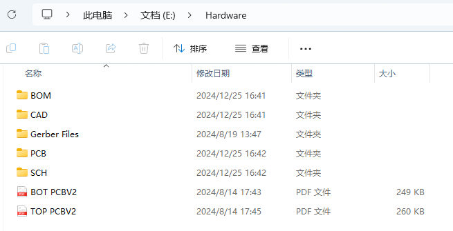
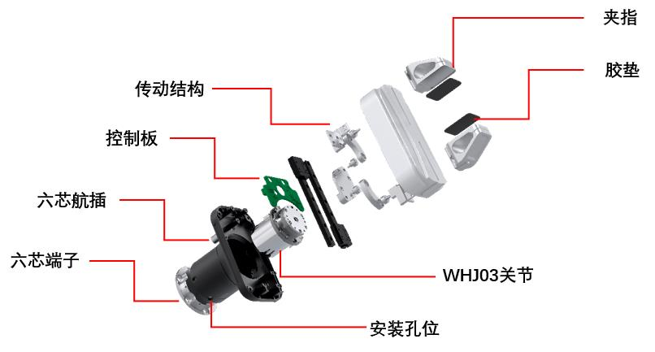
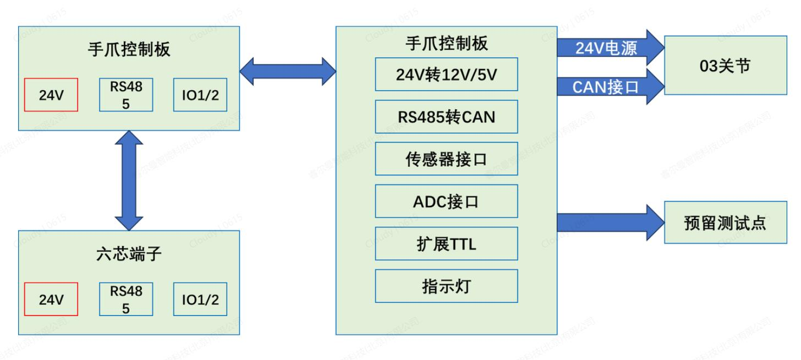
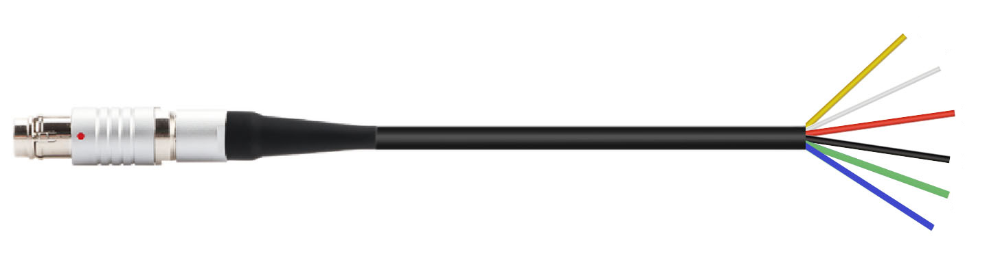

# 
 开源项目： 
 两指平行夹爪

## 版权和许可协议

本项目的硬件源信息和相关材料遵循 [OpenAtom Open Hardware License, Version 1.0](License) 许可证。

## 简介

睿尔曼两指平行夹爪旨在为用户提供易用优质的操作能力。夹爪以自研的 WHJ03 一体化关节为核心部件开发而成，具备高动态响应、高负载、小体积、通用性强、安装方便、维护简单等特点。根据任务需要，夹爪可以灵活方便的部署在复合机器人、机械臂末端、PLC 产线上，从而解决工业、商服、家庭、教育等场景的抓取、分拣、搬运等需求。机器人采用标准的 RS485 通信接口，支持串口协议和Modbus RTU协议，简单高效的接口和控制指令可以使用户快速实现对夹爪的操控。 
睿尔曼还为夹爪配备了上位机软件，通过设置不同加持力矩、速度、位置等参数，满足对不同质地形状目标的操作需求。 

**具体特点如下：**

- **高动态响应：** 开口尺寸为 65mm，单程开合时间达到 0.4s；
- **负载密度大：** 自重只有 0.5kg 左右，额定负载达到 4kg，最大负载高达 5kg；
- **通用性强：** 夹爪配备 6 芯航插和 6 芯 PH2.0 端子两种 RS485 接口，支持串口协议、Modbus RTU 协议、I/O 控制；
- **易用性强：** 多种控制模式，容易操控，适合多种场景；
- **技术方案开源：** 夹爪的技术方案全部开源，推动行业发展。

## 硬件设计

相关硬件已开源，如需下载请参考[相关下载](#相关下载)。 

### 主体结构

两指平行夹爪的主体结构如下：

1. WHJ03 关节：WHJ03关节作为两指平行夹爪的核心动力模块，输出力和运动，详情请查阅[WHJ03 关节](https://develop.realman-robotics.com/joints/parameter/WHJ03/)；
2. 传动机构：传动机构是将关节的回转运动转为直线运动的主要机构；
3. 控制板：控制板提供关节控制、RS485 通信、系统供电、扩展接口等功能；
4. 通讯接口：通讯接口六芯航插头和六芯 PH2.0 端子，位置如图所示；
5. 夹指：夹指分为标准夹指和扩展夹指，是夹爪执行操作功能的直接结构。

### 三维模型

两指平行夹爪的三维模型图，请参考获取的开源文件中`Hardware > CAD`路径下的 **RMG24夹爪三维模型(20241022)** 文件，两指平行夹爪的外观尺寸，如下图所示。

### 控制板

#### 硬件系统

两指平行夹爪硬件系统，如下图所示。

#### 单板制作

单板制作可参考获取的开源文件中`Hardware > Gerber Files`路径下的相关文件，或通过`Hardware > PCB`路径下的**TURN PCB20240806.PcbDoc**文件生成对应的Gerber文件进行单板制作。

>注意 
>**Gerber Files**推荐使用**华秋dfm**软件打开，**TURN PCB20240806.PcbDoc**为PCB格式文件，推荐使用**Altium Designer**软件打开。

#### 焊接元器件

元器件焊接可参考获取的开源文件中`Hardware > SCH`路径下的**PG_V0_20240806.SchDoc**文件，或`Hardware`路径下的**BOT PCBV2**和**TOP PCBV2**文件进行焊接。

>注意 
>**PG_V0_20240806.SchDoc**为SCH格式文件，推荐使用**Altium Designer**软件打开。

#### BOM

控制板的BOM信息，请参考获取的开源文件中`Hardware > BOM`路径下的**夹爪转接板BOM 20240821**文件。

### 通信接口

两指平行夹爪采用6芯航插、6芯PH2.0端子的通信接口。

#### 接线定义

**6芯航插：**

- 自定义航插，体积小，可直接对接RM机械臂，便于使用；
- 因其他机械臂厂家的芯数和线序都不一样，需要根据线序功能重新进行排序；
- 支持两个IO接口，因为两指平行夹爪主要用于机械臂，所以只需要保留RS485和Modus-RTU接口，就能满足大多数需求。

**6芯PH2.0端子:**

- 在手爪安装座底端固定安装母头。
- 与机械臂端盖输出的6芯端子公头连接，实现内走线，避免了两指平行夹爪在抓取过程中外走线造成的干涉。

  

6芯航插

  

6芯PH2.0端子

#### 线序和功能

6芯航插和6芯PH2.0端子的线序和功能相同，如下表所示。

|线序号|颜色|注释|说明|
|-|-|-|-|
|1|黄|RS485_A|RS485通讯A+|
|2|白|RS485_B|RS485通讯B-|
|3|红|DI1/DO1|I/O复用接口1|
|4|黑|DI2/DO2|I/O复用接口2|
|5|绿|电源GND|电源负极|
|6|蓝|电源输入24V|电源正极|

## 软件资源

目前已开源软件代码，请访问[相关下载](#相关下载)下载，后续会持续升级更新。 

### 软件源码

以下为两指平行夹爪开源的应用程序、boot程序以及上位机源码，参考获取的开源文件中`Software`路径下对应源码文件。

|序号|名称|说明|
|-|-|-|
|1|gripper_app|夹爪控制板应用程序源码|
|2|gripper_boot|夹爪控制板boot程序源码|
|3|gripper_tool|两指夹爪上位机源码|

### 上位机

主控单元可以通过上位机对两指平行夹爪进行参数配置、模式控制、协议I/O控制、状态监测和固件升级。

#### 接线

主控单元可以通过RS485转USB直连两指平行夹爪，然后通过上位机软件对夹爪进行控制。 
**具体连线方式为：**

1. 夹爪的蓝绿2根线分别接24V和GND；
2. 夹爪的黄白2根线接RS485_A、RS485_B，485模块要和夹爪电源共地； 

由于上位机部署在PC端，接口多为USB，因此用户需要配备USB转485模块，将夹爪的黄白2根线接在USB转485模块上，进而实现PC端的上位机通过USB控制夹爪的目标，线序说明请参考[线序和功能](#线序和功能)。如下图所示：

#### 软件安装

上位机软件为绿色免安装版，压缩包中包含exe文件和相关的依赖文件。解压至指定位置后，可以直接运行exe文件来启动程序，免安装，免登录，上位机界面如下。

#### 上位机调试

1. **连接/断开：**
    夹爪通过RS485转USB连接到主控单元，在主控单元打开上位机软件，首次连接输入设备出厂默认 ID、串口号、波特率 115200，点击`打开`即会显示连接成功；点击`关闭`即会断开连接。
2. **参数设置：**
    可以设置波特率，设备ID，等参数。参数设置完成后，在状态监测区域点击`读取夹爪参数`，即可显示设备所有参数。
3. **模式控制：**
    在模式控制中可以设置夹爪的限位、力矩、速度、位置等，具体如下：
    - 最大/最小限位：上位机设置夹爪的最大最小的极限位置；参数范围为0-1000，无量纲，0对应开口尺寸为0mm，1000对应标准夹指的开口尺寸65mm；
    - 力矩：上位机设置夹爪以输入的速度和力控阈值去夹取，当夹持力超过设定的力控阈值后，夹爪停止运动；参数范围为0-1000，无量纲，1000 对应额定负载4kg；
    - 速度：设置夹爪开合速度值，控制夹爪在工作过程中的开合速度。参数范围为0-1000，无量纲，其中1000对应达成开合时间为0.4s；
    - 开口度：设置夹爪的开口尺寸，夹爪接受到这条指令后，如果夹爪当前开口尺寸与设定开口尺寸不同，则夹爪以设定速度运动到开口尺寸，达到目标开口尺寸后停止运动；参数范围为0-1000，无量纲，其中1000对应开口位置为标准夹指的65mm。位置参数应小于最大限位。
    - 打开：夹爪以设置的固定速度（最大速度）将夹爪松开到最大开口位置。
    - 闭合：夹爪以设置的固定速度（最大速度）将夹爪闭合到最小开口位置。
    - 力矩夹取：夹爪以设置的速度和力矩去夹取，当夹持力超过设定的力矩值后，夹爪停止运动；当夹爪停止运动后，如果检测到夹持力小于力矩值时，夹爪会继续夹取直到夹持力超过设定的力矩值。
    - 透传使能：是为睿尔曼的遥操作的高动态响应功能开发，打开`透传使能`功能后，遥操作的主动爪将以较高的速度响应从动爪的控制，从而便于用户进行低延迟的遥操作和采集数据。

4. **协议/IO 控制：** 
    - **IO 接口配置**：用于配置2个IO接口的输入输出参数。具体操作如下：
      - **设置**：1）选择接口DIO/1或DIO/2；2）选择`输入模式`或`输出模式`，点击`模式设置`；3）对于输入模式，不需要设置；对于输出模式，则可以设置`输出高电平`、`输出低电平`；4）点击`输出设置`，完成该接口的输出参数的配置。
      - **查询**：完成设置两个接口后，点击`读取状态`，可查询两个IO 接口的状态。
      - **控制**：IO 控制可以选择开启、关闭，默认为输入模式。
    - **关节控制**：夹爪在工作一段时间之后，通过关节控制来手动实现零位设置。具体操作如下：
      - **闭合夹爪**：点击夹爪的`闭合`按钮，夹指闭合到最小位置；
      - **手动调整**：根据实际情况，在`运动角度`框中输入需要关节运动的角度，点击`运动`从而手动控制夹指运动，然后观察状态监测区的实时电流曲线的变化，当夹指完全闭合，且实时电流曲线显示为空载电流时；
      - **零位设置**：点击`零位设置`，即完成了零位校准功能，校准完成需重启设备。
    - **MB RTU 指令控制**：用于出厂的协议指令功能的调试测试。
5. **状态监测区：**
   状态监测区通过`读取夹爪参数`可以显示设置的设备 ID、波特率、最大/最小限位、夹持速度、夹持力度等参数，显示软件的版本号。通过`读取关节状态`，可以显示关节的使能、运行状态、角度、速度、电压、电流、温度、力度、开口度、错误码等，并可以执行`清除错误`操作。
6. **固件升级：**
    点击`升级文件`，找到升级文件所在的位置，选择要升级的模块：`控制板`、`关节`，点击`开始升级`后，进度条会显示升级进度。

### 通信协议

- 两指平行夹爪的相关通信协议，请参考《Two-Finger Parallel Gripper User Manual V1.0》中的通信协议章节。 

- 通过机械臂（睿尔曼）控制两指平行夹爪相关通信协议，可根据需要参考如下对应内容：

  - JSON协议：[末端工具指令集（选配）](https://develop.realman-robotics.com/robot/json/endTool.html)
  - API2 (C、C++)：[末端工具夹爪配置](https://develop.realman-robotics.com/robot/api/c/classes/gripperControl.html)
  - API2 (Python)：[末端工具夹爪配置](https://develop.realman-robotics.com/robot/api/python/classes/gripperControl.html)

## 其他相关参考

两指平行夹爪的相关资料如下，请访问[相关下载](#相关下载)中的`Related Files`路径获取。

|序号|名称|说明|
|-|-|-|
|1|Two-Finger Parallel Gripper User Manual V1.0|主要介绍了产品简介、参数、配件以及通信协议等两指平行夹爪的安装调试使用的方法和接口。|
|2|Two-Finger Parallel Gripper Product Design Specification|主要介绍了产品设计的需求分析、定义和设计流程以及硬件、软件的相关设计理念和参数。|
|3|Two-Finger Parallel Gripper Test Cases|整理了两指平行夹爪产品的测试用例，供用户参考借鉴。|

## 相关下载

<table>
    <tr>
        <th>序号</th>
        <th>名称</th>
        <th>下载地址</th>
        <th>说明</th>
    </tr>
    <tr>
        <th>1</th>
        <td>Software</td>
        <td rowspan="4"> <a href="https://pan.baidu.com/s/1PIVQjrZOQJWhZMLZMvvwxQ?pwd=j5dg#list/path=%2F">下载地址</a> </td>
        <td>包括gripper_app、gripper_boot、gripper_tool以及两指平行夹爪上位机v1.0.3，用于设置、调试两指平行夹爪。</td>
    </tr>
    <tr>
        <th>2</th>
        <td>Hardware</td>
        <td>包含3D结构图、BOM列表、原理图、PCB Layout、Placement图以及PCB的BOT、TOP图示，支撑硬件控制板、结构件制作以及整体组装。</td>
    </tr>
    <tr>
        <th>3</th>
        <td>Related Files</td>
        <td>包含产品手册、产品设计说明书以及测试用例，阐明两指平行夹爪的应用场景、功能特点、通信协议、功能参数以及验收测试的用例指导等。</td>
    </tr>
</table>
